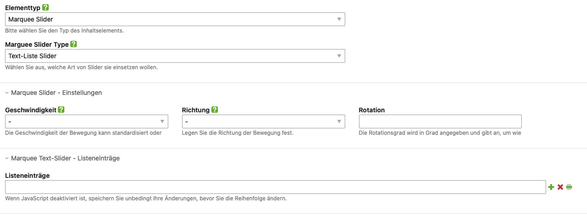
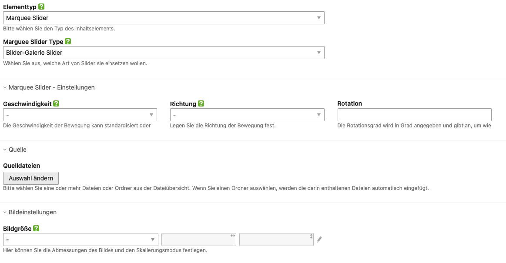

[](https://packagist.org/packages/jedocodes/contao-marquee-bundle) [](https://packagist.org/packages/jedocodes/contao-marquee-bundle) [](https://packagist.org/packages/jedocodes/contao-marquee-bundle) [](https://packagist.org/packages/jedocodes/contao-marquee-bundle)


# Contao Marquee Slider
### Ein Produkt von jedoCodes

Der Marquee Slider ist eine flexible und dynamische Möglichkeit, Inhalte auf einer Webseite in einer kontinuierlichen Bewegung zu präsentieren. Es gibt zwei Haupttypen von Marquee Slidern:

- **Text-List Slider**
- **Image Gallery Slider**

Weitere Informationen finden Sie hier: [Dokumentationen][1]

### Hauptfunktionen

- **Fortlaufende Bewegung**: Beide Slider-Typen bewegen ihre Inhalte kontinuierlich in eine bestimmte Richtung (links nach rechts oder rechts nach links).
- **Anpassbare Geschwindigkeiten**: Die Bewegungsgeschwindigkeit kann standardisiert oder benutzerdefiniert sein, was verschiedene Animationseffekte ermöglicht.
- **Responsive Darstellung**: Die Slider passen sich dynamisch an verschiedene Bildschirmgrößen und Geräte an.
- **Rotation**: Der Slider kann um einen bestimmten Winkel gedreht werden, um interessante visuelle Effekte zu erzeugen. Die Rotation wird in Grad angegeben und beeinflusst die Ausrichtung des Sliders.


### Text-List Slider

Der Text-List Slider zeigt Textinhalte in einer fortlaufenden Bewegung an. Dies eignet sich hervorragend, um Nachrichten, Ankündigungen, Zitate oder andere textuelle Elemente auf eine ansprechende Weise darzustellen.



### Image Gallery Slider

Der Image Gallery Slider präsentiert eine Sammlung von Bildern in einer kontinuierlichen Bewegung. Diese Funktionalität ist ideal für Bildgalerien, Produktbilder, Logos oder andere visuelle Inhalte.



### Zusammenfassung

Der Marquee Slider bietet eine dynamische und flexible Möglichkeit, sowohl Text- als auch Bildinhalte kontinuierlich auf einer Webseite zu bewegen. Beide Typen ermöglichen eine ansprechende Darstellung und sind anpassbar in Bezug auf Geschwindigkeit, Richtung und Rotation.

### Install

1. Install via composer or use the [Contao Manager](https://docs.contao.org/books/manager/de/)

```
composer require jedocodes/contao-marquee-bundle
```

2. Open the install tool and do a database update.


## License
Dieses Bundle ist privat und steht unter der MIT-Lizenz.


## Support
Besuchen Sie unsere [Support-Seite][2], um mehr über die verfügbaren Support-Optionen zu erfahren.

[1]: https://docs.jedo.codes
[2]: https://jedo.codes/support.html
